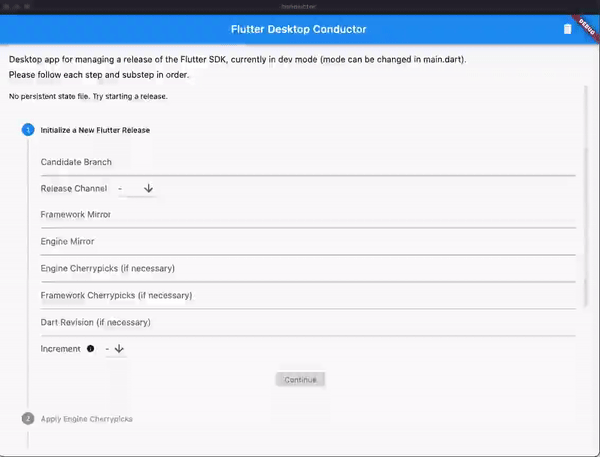

The release dashboard is a Flutter desktop app to publish a release of the Flutter SDK.
It has the same functionalities as the command-line tool (conductor: https://github.com/flutter/flutter/tree/master/dev/conductor) with a user-friendly UI and an improved workflow. It uses the same core code
as the conductor.

It is designed to make the Flutter SDK release process easier.

Also see
https://github.com/flutter/flutter/wiki/Release-process for more information on
the release process.

Demo:

## Requirements

Some basic requirements to use the release dashboard:

- a Linux or macOS computer set up for Flutter development. The release dashboard does
  not support Windows.
- git
- Mirrors on GitHub of the Flutter
  [framework](https://github.com/flutter/flutter) and
  [engine](https://github.com/flutter/engine) repositories.
- Flutter SDK >=2.12.0 <3.0.0 with macOS or Linux desktop enabled.

# Using the release dashboard

Run this app as a macOS or Linux desktop app locally from the root directory, and follow each step and substeps
in order. Check each substep when it is completed. 

The release dashboard supports resuming from a previously incompleted release. In another word, if the app is closed or stopped during a release in progress, reopening the app will resume the release progress from where it was left off. 

The release dashboard could be used with the CLI conductor interchangeably. A release initialized in the release
dashboard could be deleted or continued in the CLI conductor, or vice versa. But it is not recommended.

## Production or Development modes

The release dashboard supports production and development modes. To toggle between the modes, simply
switch the boolean `isDev` located before `WidgetsFlutterBinding.ensureInitialized();` in `./lib/main.dart`.
If `isDev` is true (default), the release dashboard is in the development mode. Otherwise, it is in the production mode.
